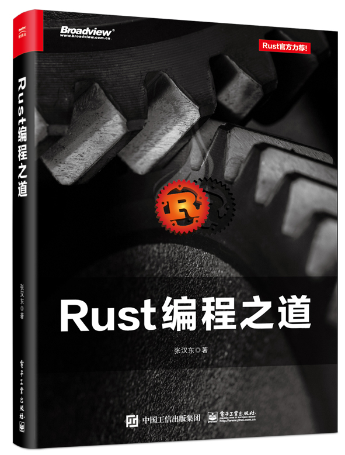
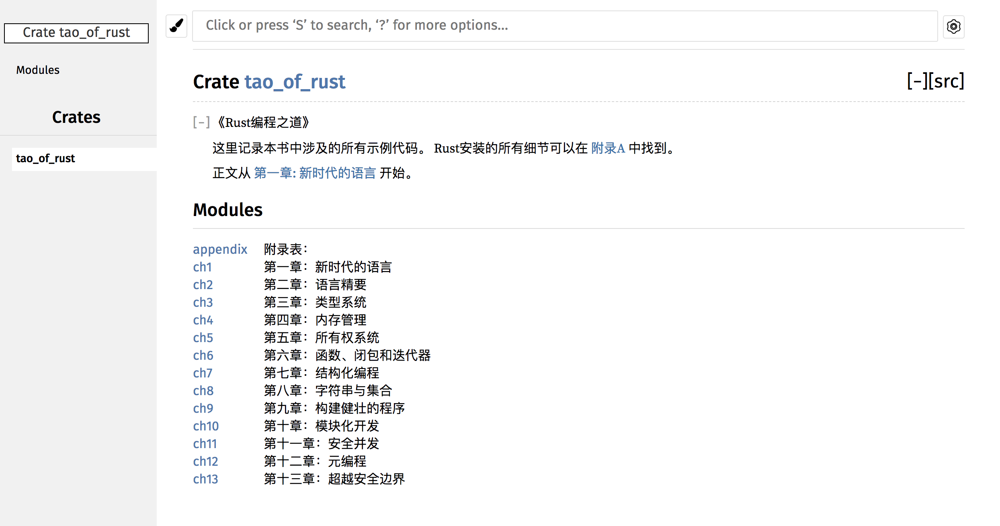
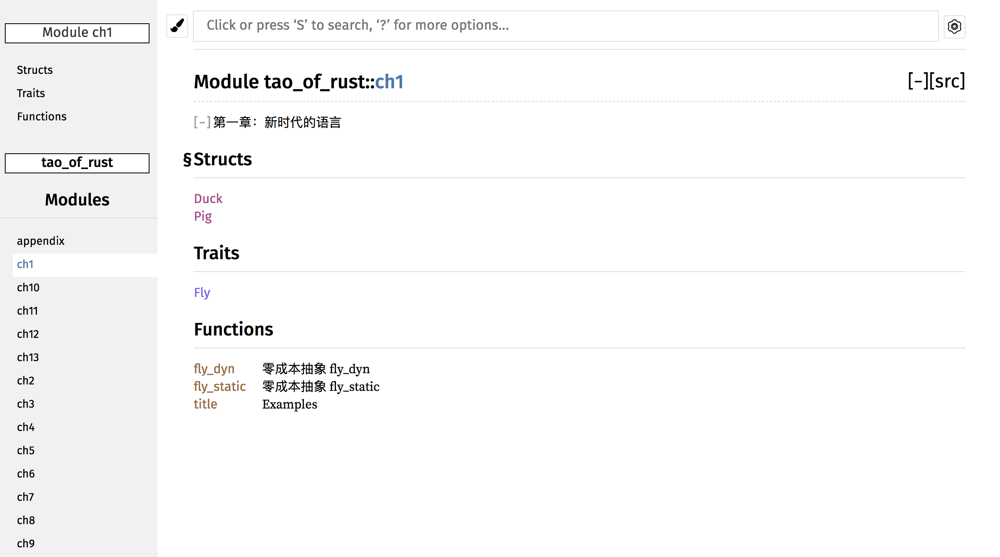
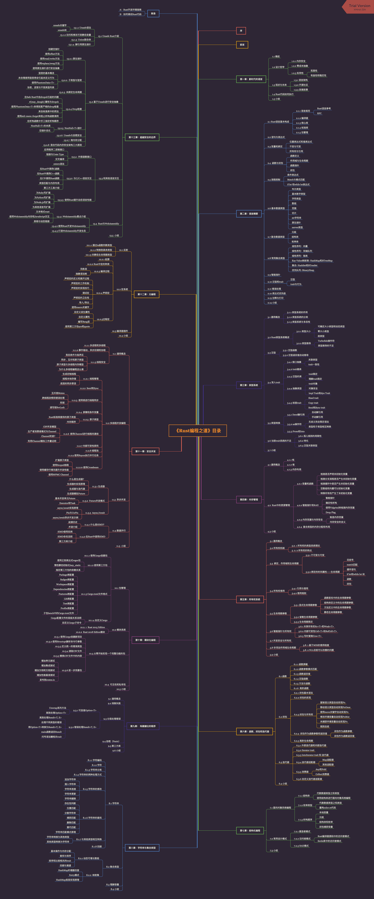

[](./LICENSE)



# 《Rust编程之道》随书源码

本书预计2018.12月底出版，

**跟进Rust 2018最新特性！！**

**跟进Rust 2018最新特性！！**

**跟进Rust 2018最新特性！！**

说明：本仓库代码暂时不接受任何PR，因为很多都是随书源码案例，其中代码有专门的演示作用。如有异议，可以提交issues讨论。

_注意：本书代码的平台是Linux或macOS_

### 书籍勘误说明

1. 提交issues
2. 表明具体的「页码」、「行数」和「出错」信息
3. 积极勘误者将获得Rust勋章一枚

### Rust版本依赖：

- `Rust stable 1.28 + `
- `Rust Nightly 1.30 +`

输出文档时指定target目录：

```
$ cargo doc --target-dir ./
```

### 使用说明：

```shell
$ git clone https://github.com/ZhangHanDong/tao-of-rust-codes.git
$ cd tao-of-rust-codes
$ cargo doc
$ open target/doc/tao_of_rust/index.html
```

在线阅读：

- [在线GitHub Page在线文档](https://ruststudy.github.io/tao_of_rust_docs/tao_of_rust/)

or：

- 在线阅读[docs.rs/tao-of-rust](https://docs.rs/crate/tao-of-rust/)

（注意，因为doc.rs还不支持Rust 2018 edition，导致build失败，文档还无法在线查看）

### 图示





点击Run，跳转到[play.rust-lang.org](https://play.rust-lang.org)


### 本书完整目录


